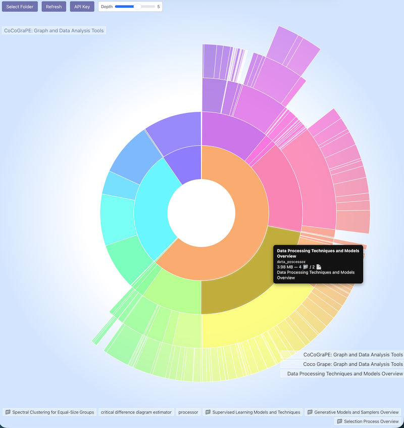

# SemanticFolderVisualizer
An AI-powered visual explorer that transforms folder structures into interactive, meaningful maps using GPT and D3.js.

  

**Unleash the hidden stories inside your folders.** This AI-powered Semantic Folder Visualizer transforms ordinary file structures into stunning, interactive maps of meaning. Powered by GPT and D3.js, it doesn’t just show you what’s inside a directory—it tells you *why it matters*. Summarize contents, reveal hidden themes, and explore your digital archives like a living ecosystem. Whether you're a researcher, designer, or digital hoarder, this tool makes your data not just visible, but *understandable*.

---
As you hover over the sectors, detailed information about the folder’s contents appears at the bottom, while the full trail of ancestor folders is displayed on the right. Clicking on a sector recentres the view around that folder, allowing you to seamlessly dive deeper. In this way, you can:

1. **Descend interactively into the folder you’re interested in**, and
2. **Explore its contents in context**, without losing your place in the hierarchy.
---
To run the visualizer, simply **save the HTML file anywhere on your computer and open it in a browser**—Safari works best. To unlock semantic summaries, you’ll need to **enter your OpenAI API key** when prompted. Then, **select a root folder** to begin exploring. If you skip the API key, the tool will still work, but it will display cleaned-up filenames rather than semantic summaries.

> 🔍 Note: Summaries are **recursively computed based only on filenames**, not the actual file contents.
---

### **Purpose**

To:

* Load a folder of files on your computer
* Visualize its structure as a radial hierarchy
* Use GPT to semantically **summarize folder contents**
* Provide an **interactive UI** for zooming, browsing, and understanding file composition

---

### **Main Components**

#### 1. **User Interface (HTML + CSS)**

* **Buttons**:

  * `Select Folder`: Triggers file input (`webkitdirectory`)
  * `Refresh`: Rebuilds visualization and forces GPT recomputation
  * `API Key`: Opens a modal to enter OpenAI key
* **Progress bar**: Tracks phase progress (scan, title generation, summary)
* **Sidebar Panels**:

  * Breadcrumb trail (`#breadcrumbs`)
  * Vertical ancestor list (`#ancestors`)
  * Children of selected folder (`#children`)
* **Radial D3 SVG Chart**: Visualizes the folder tree using concentric rings

#### 2. **Core JavaScript Features**

* **Folder Parsing**:

  * Uses `webkitRelativePath` to reconstruct the directory tree
  * Ignores folders like `__pycache__`, `.git`, etc.
* **Visualization**:

  * Renders a D3 radial partition layout
  * Arcs are sized by log-scaled file size
  * Hover shows a tooltip with file/folder details and summary
* **Semantic Summarization (via GPT)**:

  * Folders and files get short semantic titles and paragraph summaries
  * Results are cached in `localStorage` (keyed by folder hash)
* **OpenAI Integration**:

  * Uses `gpt-4o-mini` to generate summaries
  * If no API key is set, falls back to cleaning folder names

#### 3. **Semantic Title Logic**

* Files get cleaned versions of their filenames
* Folders receive:

  * A short title (≤8 words) describing their children
  * A paragraph summary combining their children’s summaries
* Uses two types of GPT prompts:

  * **Short phrase**: for each file/folder name
  * **Paragraph**: summarizing all children of a folder

#### 4. **Caching System**

* LocalStorage is used extensively:

  * Titles and summaries cached per folder path
  * Semantic trees are stored with parent references stripped (and restored later)

---

### Visual Behavior

* Each level of the hierarchy is a **concentric ring**
* **Clicking** on a segment zooms in and updates:

  * The breadcrumb trail
  * The ancestors on the right
  * The children list at the bottom
* **Mouseover** triggers a tooltip and summary load

---

### Modes and Behaviour

* **Refresh button**:

  * Forces recomputation of semantic titles/summaries
  * Clears existing `localStorage` cache for the selected folder
* **API Key Modal**:

  * Allows user to save OpenAI API key for GPT calls
* **Safari Handling**:

  * Adjusts UI if folder selection is unsupported

---

### Summary

This code provides a **visually rich, AI-enhanced tool** for understanding the semantic structure of folders. It mixes:

* Frontend D3 visualizations
* LLM-based summarization
* Client-side caching
* Dynamic UI generation
